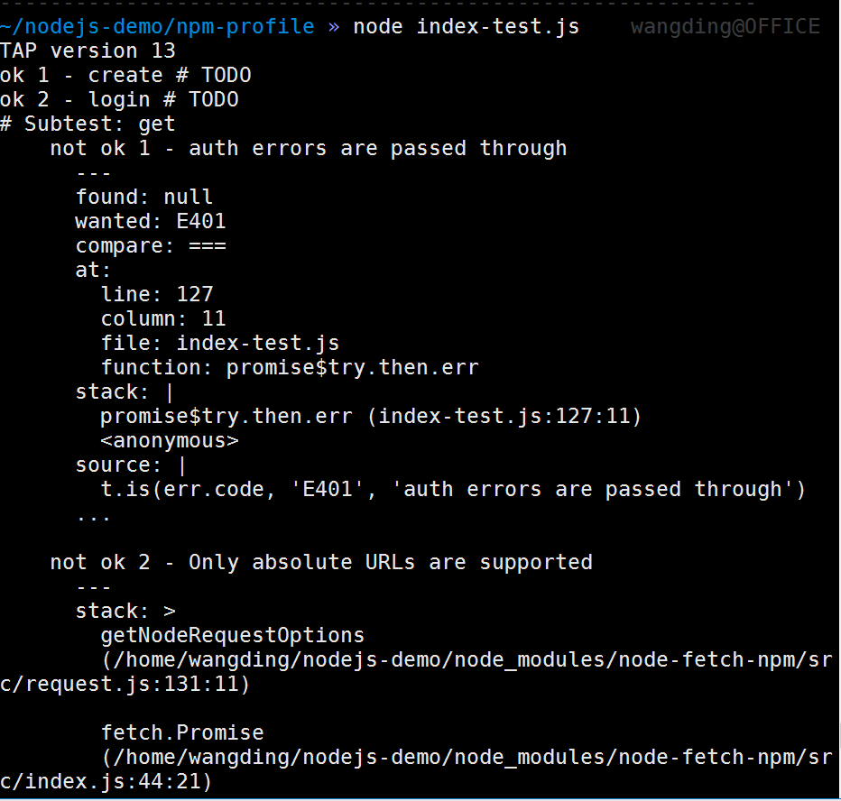
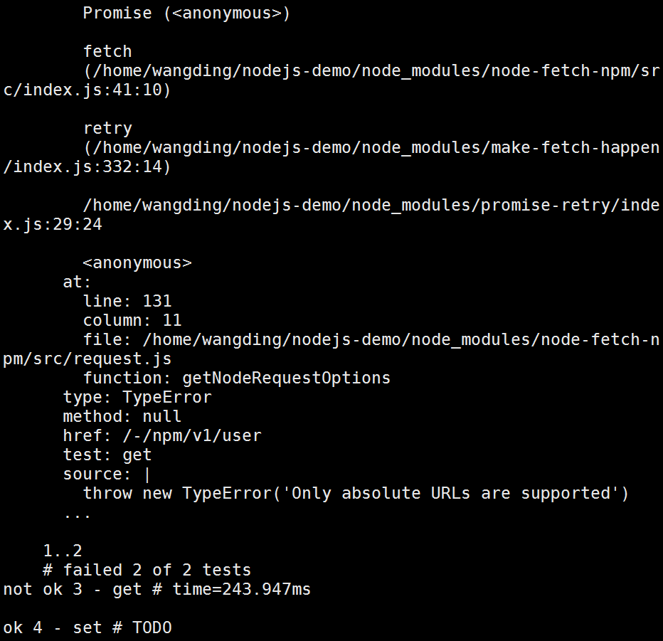
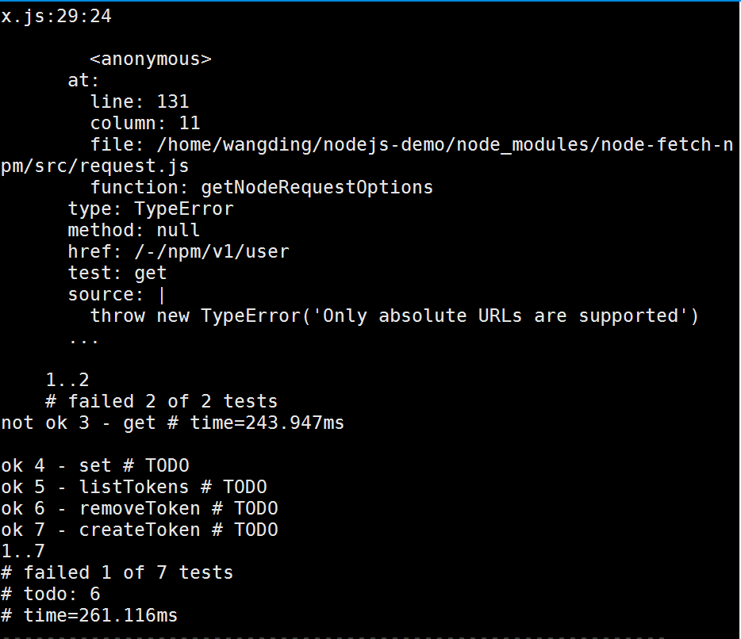
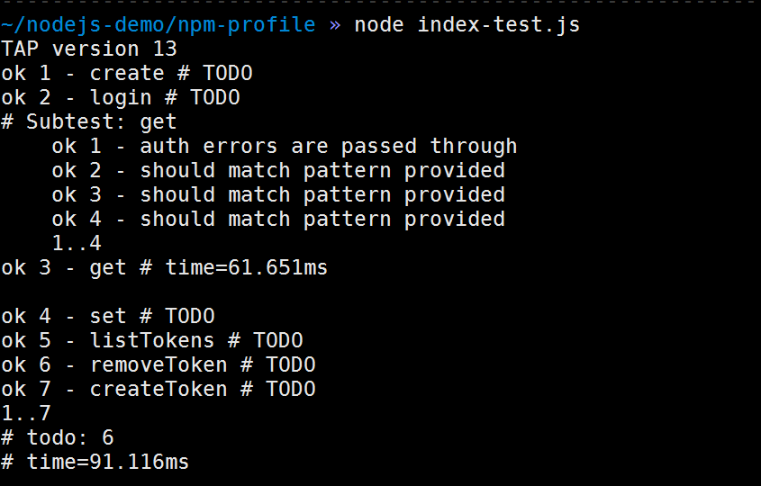

# 问题清单
>## **一、仓库简介：**
1.  **仓库名称：**  
>>fruit-repository  
>>**仓库地址：**https://github.com/Mrweiwei/fruit-repository/tree/add-license-2/npm-profile
2. **仓库包含文件及作用**
>>>index.js    
>>>作用：项目主文件，也是项目的入口文件，其中暴露的函数作为第三方模块引用  
>>README.md  
>>>作用：对项目作描述和说明  
>>.gitignore  
>>>作用：用来排除不必要的项目文件或敏感信息文件，在此文件中写入的文件不会被提交到远程仓库  
>>LICENSE  
>>>作用：文件统一用的MIT共享协议  
>>package.json  
>>>作用：存储工程的元数据，描述项目的依赖项，类似配置文件。
>>>doc文件夹（learning achievement.md）
作用：用来存放learning achievement.md文件（作用记录整个学习过程）。
>>>images文件夹
作用：用来存放一些代码文件执行的截图
>>test文件夹
作用：用来存放检测index文件的文件代码
3. **项目依赖项:**
+ make-fetch-happen         
作用：一个node-fetch-npm包含附加功能的Node.js库，node-fetch并不打算包括HTTP缓存支持，请求池，代理，重试等等！），并设置其默认属性中的请求重试设置的属性值为false（即不请求重试）。
+ aproba        
作用：一个轻量级函数参数验证器  
+ url        
作用：用于URL解析和解析的实用程序  
+ jshint        
作用：JS代码风格检测工具  
+ require-inject      
作用：一个简单的模拟注射器兼容，无需在被测试的库中进行检测
+ tapTAP测试框架    
作用：
1. 用于在Node.js中编写测试的测试框架
2. 用于运行测试和报告成功或失败的命令行界面。
3. 支持测试覆盖，包括子进程的覆盖，并与Coveralls.io和Codecov.io集成。
4. 支持并行测试，包括并行运行一些测试，以及其他测试。

>## **二、解读代码：**
1. **项目的功能：**  
提供获取和更新npmjs.com配置文件的功能并且这个实现的API记录在认证和配置文件编辑（和双因素认证）
2. **项目的类型：**  
第三方库
3. **代码模块中的函数：**  
共有11个函数分别如下：  
1 .adduser函数       
作用：在服务器上创建一个新用户以及一个新的不记名令牌，以便作为此用户的将来验证。这就是你所看到authToken的 .npmrc。如果用户已经存在，那么npm注册表将返回一个错误，但这是注册表特定的，不能保证。    
2 .login函数         
作用：将您记录到现有的用户。如果用户不存在，则不创建用户。登录意味着生成一个新的不记名令牌用于未来的认证。这是你在一个authToken中使用的.npmrc。    
3 .get函数            
作用：获取已认证用户的配置文件信息。    
4 .set函数            
作用：更新已认证用户的配置文件信息。    
5 .listTokens函数        
作用：获取经过身份验证的用户拥有的所有身份验证令牌的列表。    
6 .removeToken函数       
作用：删除特定的身份验证令牌。    
7 .createToken函数         
作用：创建一个新的身份验证令牌，可能有限制。      
8 .FetchError函数          
作用：获取错误信息的函数      
9 .authHeaders函数         
作用：验证标题函数      
10 .fetchJSON函数          
作用：获取JSON方法      
11 .packageName函数        
作用：实现对包的异常捕获的方法      
4. **代码中比较难弄的函数：**  
listTokens函数、fetchJSON函数和packageName函数。    
函数的功能基本搞明白了，这些函数中难的的原因是里面每个对象的方法是原来没见过的，所以看起来比较麻烦。
5. **项目中的数据结构：**
+ 字符串：类型判断，值判断，截取赋值等
+ 数组：进行对象中属性的键值对比查找
+ 对象：作为函数返回值，作为对象的属性，类型判断等
6. **执行index-test.js的成果图（一个函数失败，六个函数成功 利用的是TAP测试框架）**

**经过细致的问题查找，从package.json文件中发现tap和require-inject两个模块已经被写死，导致无法执行npm install 这个两个模块，解决完问题后的效果图如下:**  

7. **阅读代码心得**  
在整个阅读代码过程中，心态时好时坏，敲入执行时报错就会茫然，但是坚持寻找解决方法才是解决问题的关键。
8. **高级的JavaScript语法**
>首先整个index.js文件中支持的全是ES6语法格式，使用const常量声明还有箭头函数的使用。
+ JavaScript数组的 forEach()方法调用数组中的每个元素。
+ Object.assign方法用于对象的合并，将源对象（ source ）的所有可枚举属性，复制到目标对象（ target ）。
+ concat() 方法用于连接两个或多个数组。该方法不会改变现有的数组，而仅仅会返回被连接数组的一个副本。
+ ES6提供了更接近传统语言的写法，引入了Class（类）这个概念，作为对象的模板。通过class关键字，可以定义类。基本上，ES6的class可以看作只是一个语法糖，它的绝大部分功能，ES5都可以做到，新的class写法只是让对象原型的写法更加清晰、更像面向对象编程的语法而已。
+ String.indexOf()用于报告指定字符在此实例中的第一个匹配项的索引。搜索从指定字符位置开始，并检查指定数量的字符位置。
9. **设计模式**  

代码模块|是否暴露为模块|描述
-|-|-
const,require||全局变量定义和引入第三方模块
exports||暴露模块
make-fetch-happen|是|一个node-fetch-npm包含附加功能的Node.js库，node-fetch并不打算包括HTTP缓存支持，请求池，代理，重试等等！）
aproba  | 是|一个轻量级函数参数验证器
url| 是|用于URL解析和解析的实用程序

10. **自动化测试**
我用到的是TAP测试，全称是Test Anything Protocol它是可靠性测试的一种（tried & true）实现从1987就有了，有很多语言都实现了。它说白点就是用贼简单的方式来格式化测试结果。
11. 

